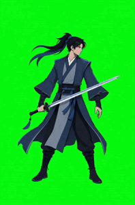
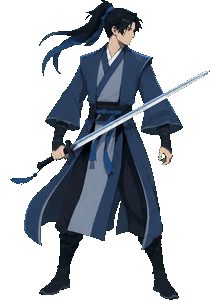

<a id="top"></a>

# AI Sprite Animator · AI 綠幕影片轉 Sprite Sheet 工具

<div align="center">

### 🌐 English　｜　[🇹🇼 繁體中文 ↓](#繁體中文)

</div>

Turn a **green-screen animation video** into a clean, transparent **sprite sheet** — 100% in your browser. No upload, no install, free.

**Live demo:** https://zxc02621948-sketch.github.io/ai-sprite-animator/

Made for AI game devs: generate a character animation as a green-screen video (Seedance, Kling, Runway, Grok…), drop it in, and get a game-ready transparent PNG sprite sheet.

## Demo

<table>
<tr>
<td align="center"><b>Input — green-screen video</b><br></td>
<td align="center"><b>Output — transparent sprite sheet</b><br></td>
</tr>
</table>

## The idea: video → slice, not frame-by-frame AI

AI image models drift when you ask them to generate an animation **frame by frame** — the character jitters, details wander, and past ~8 frames it falls apart.

**The trick:** don't generate frames. Generate one **continuous green-screen video**, then slice it. Because a video is one continuous thing, every sliced frame is **naturally consistent** — you sidestep the AI per-frame inconsistency problem, and you can pull 16 / 24 / 32 crisp frames instead of 8.

This tool does the rest: chroma-key the green out → trim each frame → pack into a tight grid → export a transparent sprite sheet.

## What is a sprite sheet?

A **sprite** is a 2D image used in games (a character, enemy, item, effect, or UI icon). A **sprite sheet** packs multiple animation frames into a single image; the game plays them one by one to create animation.

```text
[Frame 1][Frame 2][Frame 3][Frame 4]
[Frame 5][Frame 6][Frame 7][Frame 8]
```

## Features

- **Green-screen removal** — YUV chroma key with auto color detection + adjustable similarity / edge softness / spill suppression.
- **Full resolution, no blur** — frames are extracted at the video's native resolution (slicing a video, not one big image), so more frames never means blurrier.
- **Auto-trim** — every frame is cropped to a shared opaque bounding box (kept registered so the sprite doesn't jitter), cutting wasted transparent pixels.
- **Segment select** — pick a start/end range of the clip; a still thumbnail shows the frame at each handle so you're not cutting blind.
- **Ping-pong output** — bake a seamless forward+back loop (N → 2N-2 frames) so idle animations loop with no seam, using plain sequential playback in any engine.
- **Frame count & grid** — choose 8 / 12 / 16 / 24 (or custom) and columns, or an auto square-ish grid.
- **Real-time preview** — plays back at the source's real speed; changing frame count changes smoothness, not speed.
- **Transparent PNG + JSON** — download a transparent sprite sheet plus a JSON descriptor with every frame's grid coordinates.
- **Client-side & private** — everything runs in your browser via the native `<video>` decoder + canvas. Your footage never leaves your machine.

## How to use

1. Open the [live demo](https://zxc02621948-sketch.github.io/ai-sprite-animator/), or run locally (below).
2. Drag in a green-screen animation video (mp4 / H.264 or webm).
3. Pick a frame count (8 / 12 / 16 / 24).
4. *(Optional)* trim to a segment, tweak the chroma-key sliders, tick **ping-pong** for seamless idles.
5. Click **Generate**.
6. Download the transparent PNG (and the JSON grid metadata).

## Running locally

It's plain ES modules, so it needs a tiny static server (opening `index.html` via `file://` won't load modules):

```bash
node serve.js          # → http://localhost:5173
```

On Windows you can just double-click **`run.bat`**. A sample clip is included at `test-assets/greenscreen.mp4` so you can try the whole pipeline immediately.

## How it works

```text
green-screen video
  → extract N frames (native <video> seek + canvas, full resolution)
  → chroma key (YUV distance + spill suppression → transparent)
  → trim each frame to the shared opaque bounding box
  → pack into a uniform grid (optionally ping-pong)
  → export transparent PNG + JSON coordinates
```

The tool uses the browser's **native video decoding** instead of `ffmpeg.wasm`, so there's no `SharedArrayBuffer` / COOP-COEP requirement and it deploys to any static host as-is. The `src/core/` modules (chroma / trim / pack) are pure functions over RGBA buffers, so a future CLI (native `ffmpeg` + `sharp`) can reuse them verbatim.

## Part of the AI Game Asset Toolkit

A small set of free, browser-based tools for AI game devs — chain them:

**green-screen video → [AI Sprite Animator](https://zxc02621948-sketch.github.io/ai-sprite-animator/) (this) → [AI Sprite Align Tool](https://zxc02621948-sketch.github.io/ai-sprite-align-tool/) → game**

- [Game Asset BG Remover](https://zxc02621948-sketch.github.io/game-asset-bg-remover/) — remove backgrounds from game art
- [AI Sprite Align Tool](https://zxc02621948-sketch.github.io/ai-sprite-align-tool/) — stabilize/align sprite-sheet frames

## ☕ Support

This tool is free and open source. If it helps you, consider buying me a coffee: https://ko-fi.com/kuanming

## License

Code is released under the [MIT License](LICENSE). Demo images, GIFs, sprite sheets, and other visual assets are for demonstration/documentation only and are not part of the MIT-licensed code unless explicitly stated.

---

## 繁體中文

<div align="center">

### [🌐 English ↑](#top)　｜　🇹🇼 繁體中文

</div>

把一段**綠幕動畫影片**變成乾淨、透明的 **sprite sheet** —— 全程在瀏覽器完成,不上傳、免安裝、免費。

**線上工具:** https://zxc02621948-sketch.github.io/ai-sprite-animator/

專為 AI 遊戲開發者做的:用綠幕影片生一段角色動畫(Seedance、Kling、Runway、Grok…),丟進來,拿回遊戲可直接用的透明 PNG sprite sheet。

### 展示效果

<table>
<tr>
<td align="center"><b>輸入 — 綠幕影片</b><br></td>
<td align="center"><b>輸出 — 透明 sprite sheet</b><br></td>
</tr>
</table>

### 核心點子:用「影片切片」,不要逐格 AI 生成

AI 逐格生成動畫時會飄:角色跳動、細節亂跑,超過 8 格就崩。

**訣竅:** 不要逐格生,而是生一段**連續的綠幕影片**再切片。因為影片是連續的,切出來的每一格**天生就一致** —— 直接繞過「AI 逐格不一致」的死穴,還能切出 16 / 24 / 32 格清晰畫面,而不是只有 8 格。

剩下的工具包辦:綠幕去背 → 每格裁掉空白 → 緊密打包 → 輸出透明 sprite sheet。

### 什麼是 Sprite / Sprite sheet?

**Sprite** 是遊戲用的 2D 圖(角色、敵人、道具、特效、UI 圖示)。**Sprite sheet** 把多張動畫格集中在同一張圖,遊戲依序切出每格播放形成動畫。

### 功能

- **綠幕去背** —— YUV 色度去背,自動偵測綠色 + 可調相似度 / 邊緣柔化 / 溢色抑制。
- **完整解析度不糊** —— 從影片抽格是影片的完整解析度(不是切一張大圖),所以切越多格也不會變糊。
- **自動裁切** —— 每格裁到共用的不透明邊界框(保持對位不抖),省掉浪費的透明像素。
- **片段裁切** —— 拖 start/end 選區間,縮圖顯示把手處的畫面,不用盲剪。
- **正反輪播(乒乓)輸出** —— 勾選後烘成無縫來回循環(N → 2N-2 格),待機動畫用最普通的順序輪播就接不出斷點。
- **格數與網格** —— 8 / 12 / 16 / 24(或自訂)、可設欄數或自動接近正方。
- **即時預覽** —— 用影片原速播放;換格數只影響順不順、不影響快慢。
- **透明 PNG + JSON** —— 下載透明 sprite sheet,附每格座標的 JSON。
- **本地運算、隱私** —— 全程用瀏覽器原生 `<video>` 解碼 + canvas,影片不離開你的電腦。

### 怎麼用

1. 開[線上工具](https://zxc02621948-sketch.github.io/ai-sprite-animator/),或在本地執行(見下)。
2. 拖入綠幕動畫影片(mp4 / H.264 或 webm)。
3. 選格數(8 / 12 / 16 / 24)。
4. *(可選)* 裁切片段、調去背滑桿、勾**正反輪播**做無縫待機。
5. 按**生成 Sprite Sheet**。
6. 下載透明 PNG(和 JSON 座標資料)。

### 本地執行

本工具是純 ES module,需要一個小型靜態伺服器(直接用 `file://` 開 `index.html` 無法載入模組):

```bash
node serve.js          # → http://localhost:5173
```

Windows 可直接雙擊 **`run.bat`**。倉庫附了測試片 `test-assets/greenscreen.mp4`,clone 下來就能立刻試整條管線。

### 運作原理

```text
綠幕影片
  → 抽 N 格(原生 <video> seek + canvas,完整解析度)
  → 綠幕去背(YUV 色度距離 + 溢色抑制 → 透明)
  → 每格裁到共用不透明邊界框
  → 打包成網格(可選乒乓)
  → 輸出透明 PNG + JSON 座標
```

用瀏覽器**原生影片解碼**而非 `ffmpeg.wasm`,所以不需要 `SharedArrayBuffer` / COOP-COEP,任何靜態空間都能直接部署。`src/core/`(chroma / trim / pack)是對 RGBA 緩衝的純函式,之後 CLI 版(原生 `ffmpeg` + `sharp`)可原封重用。

### AI 遊戲素材工具組的一員

一組給 AI 遊戲開發者的免費瀏覽器工具,可串起來用:

**綠幕影片 → [AI Sprite Animator](https://zxc02621948-sketch.github.io/ai-sprite-animator/)(本工具)→ [AI 動畫格對齊工具](https://zxc02621948-sketch.github.io/ai-sprite-align-tool/) → 遊戲**

- [遊戲素材去背助手](https://zxc02621948-sketch.github.io/game-asset-bg-remover/) —— 幫遊戲素材去背
- [AI 動畫格對齊工具](https://zxc02621948-sketch.github.io/ai-sprite-align-tool/) —— 讓 sprite sheet 每格對齊、播放更穩

### ☕ 支持作者

這個工具是免費且開源的。如果它對你有幫助,歡迎請我喝杯咖啡,支持我持續維護與開發更多免費工具:
👉 https://ko-fi.com/kuanming

### 授權

程式碼採用 [MIT License](LICENSE)。倉庫中的示範圖片、GIF、sprite sheet 與其他視覺素材僅供展示與文件說明,除非另有標示,否則不含在 MIT 授權的程式碼範圍內。
